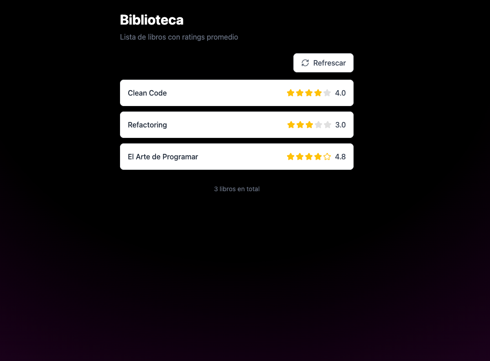
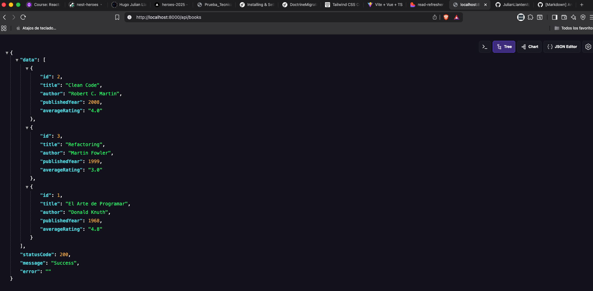

# Proyecto: Tidelit Libros (Symfony 6 + Vue 3)

### Este proyecto es una API RESTful desarrollada con Symfony 6 que gestiona una colección de libros y sus reseñas. La API permite realizar operaciones CRUD (Crear, Leer) en libros y reseñas.


### Requisitos

1. PHP >= 8.1
2. Composer
5. MySQL/PostgreSQL


### Instalación
1. Clona el repositorio:
   ```bash
   git clone https://github.com/JulianLlanten8/backend-books.git
   ````
2. Navega al directorio del proyecto:
   ```bash
   cd tidelit-books
   ```
3. Instala las dependencias de PHP:
   ```bash
   composer install
   ```
4. Crear base de datos:
   ```bash
   CREATE DATABASE tidelit_books;

   php bin/console doctrine:database:create
   ```
5. Ejecuta las migraciones para crear las tablas necesarias:
    ```bash
    php bin/console doctrine:migrations:migrate
    ```
6. Cargar datos iniciales (fixtures):
    ```bash
    php bin/console doctrine:fixtures:load
    ```
7. Configura las variables de entorno en el archivo `.env` o `.env.example` según tus necesidades.
    ```bash
    cp .env.example .env
    ```

8. Inicia el servidor de desarrollo:
   ```bash
   symfony server:start
   ```
9. Accede a la aplicación en tu navegador web en `http://localhost:8000/api/books` o mira la colección de Postman aqui: [text](docs/books.postman_collection.json)

> [!NOTE]
> **Sobre averageRating** Si un libro no tiene reseñas, averageRating será null. Esta elección permite diferenciar entre “libro sin reseñas” (null) y un libro con reseñas que suman cero (0). El frontend puede mostrar un mensaje como “Sin reseñas aún” cuando averageRating sea null.

### Endpoints
- **GET /api/books**: Obtiene una lista de todos los libros con su averageRating.
- **POST /api/books**: Crea un nuevo libro.

### Respuestas esperadas ante errores de validación

Al intentar crear una reseña vía `POST /api/reviews`, si los datos no cumplen las validaciones, la API devuelve un **HTTP 400 Bad Request** con un JSON que describe los errores. Ejemplos:

```json
{
  "errors": {
    "rating": [
      "El campo rating es requerido",
      "El campo rating debe estar entre 1 y 5"
    ],
    "comment": ["El campo comment no puede estar vacío"],
    "book": ["El libro indicado no existe"]
  }
}